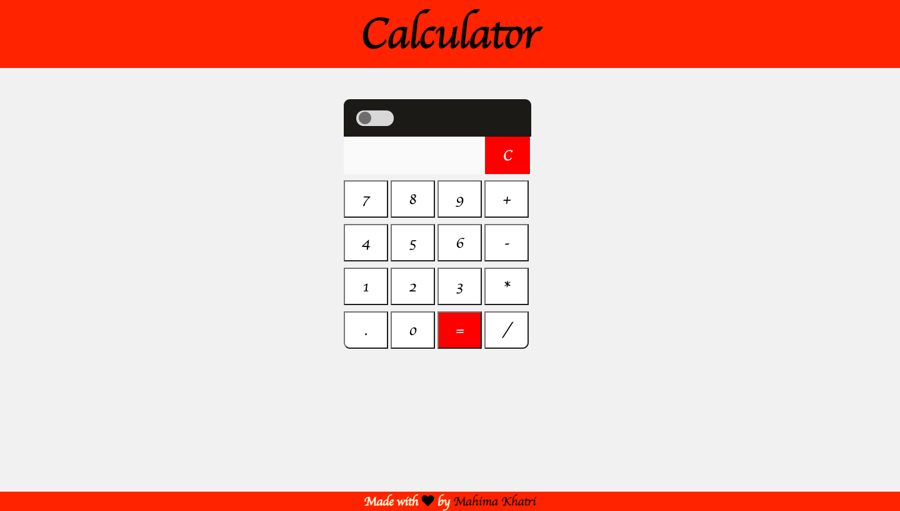
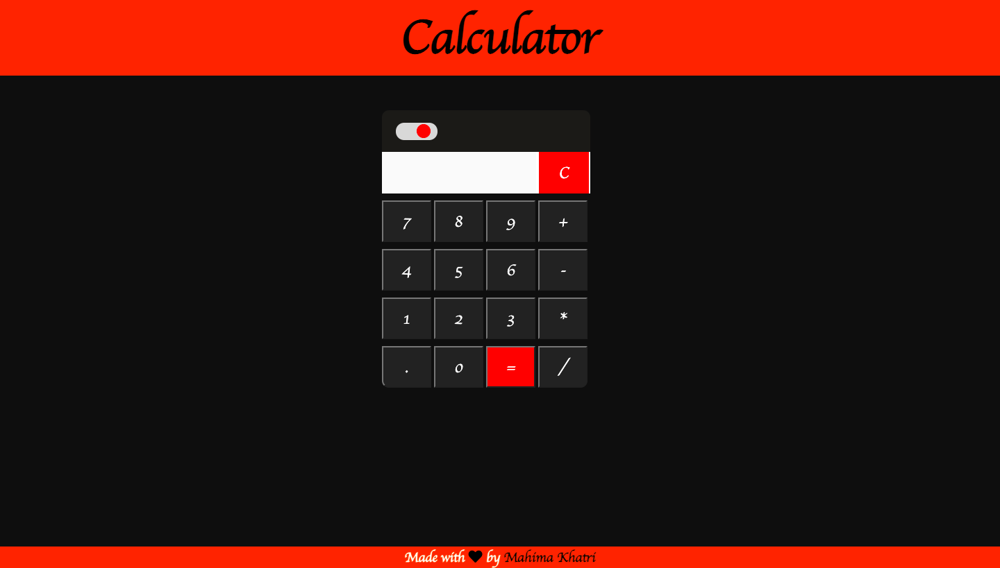

# Calculator :1234:

## Introduction :shamrock:

In this project , all the functions of a basic calculator are being implemented by using HTML, CSS and JavaScript . A simple calculator application is made in order to perform basic functions of a calculator. A switch is added so as to implement dark mode and light mode in the calculator which makes the interface look more interactive.

## Features :eyes:

### Home Page

### Light Mode

### Dark Mode

### Working

## Tech Stack
+ HTML
+ CSS
+ JavaScript

## Developer :woman_technologist:
<table>
<td>

Mahima Khatri

</td>
</tr>
</table>
